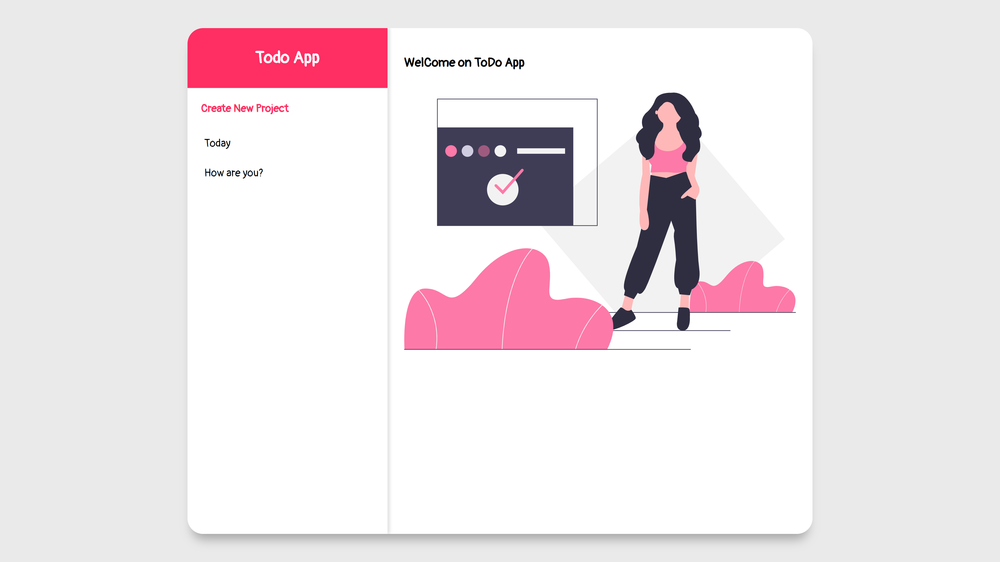

# Todo App

[![Contributors][contributors-shield]][contributors-url]
[![Forks][forks-shield]][forks-url]
[![Stargazers][stars-shield]][stars-url]
[![Issues][issues-shield]][issues-url]
[![MIT License][license-shield]][license-url]
[![LinkedIn][linkedin-shield]][linkedin-url]


<!-- PROJECT LOGO -->
<br />
<p align="center">
  
  <h3 align="center">Todo APp</h3>

  <p align="center">
    A simple To-do list app built with Vanilla JS and Webpack
    <br />
    <a href="#about-the-project"><strong>Explore the docs »</strong></a>
    <br />
    <br />
    <a href="https://rawcdn.githack.com/tigamadou/todoapp/9f3d9db6b0f81a66dc2b918741a505b5cf2e3911/dist/index.html" target="_blank" >View Demo</a>
    ·
    <a href="https://github.com/tigamadou/todoapp/issues">Report Bug</a>
    ·
    <a href="https://github.com/tigamadou/todoapp/issues">Request Feature</a>
  </p>
</p>


<!-- TABLE OF CONTENTS -->
## Table of Contents

* [About the Project](#about-the-project)
  * [Built With](#built-with)
* [Getting Started](#getting-started)
  * [Prerequisites](#prerequisites)
  * [Installation](#installation)
* [Usage](#usage)
* [Testing](#testing)
* [Contributing](#contributing)
* [License](#license)
* [Contact](#contact)
* [Acknowledgements](#acknowledgements)


<!-- ABOUT THE PROJECT -->
## About The Project


This is a beautiful Todo list app we've built following [Microverse Program](https://microverse.org)  and [TheOdinProject](https://www.theodinproject.com/courses/javascript/lessons/todoapp) guidelines.

### Built With
* [Javascript ES6]()
* [Object Oriented Programming]()
* [WEBPACK]()
* [SCSS]()


<!-- GETTING STARTED -->
## Getting Started

To get a local copy up and running follow these installation steps.


### Prerequisites
This app require: nodejs. If you don't have not installed yet, do the following commands in your terminal.
* npm
```sh
npm install npm@latest -g
```

### Installation

1. Clone the repo

```sh
git clone https://github.com/tigamadou/todoapp
```

2. Browse to the cloned folder
```sh
cd todoapp
```

3. Install NPM packages
```sh
npm install / yarn 
```

## Usage
1. Browse to the cloned folder
```sh
cd todoapp
```
2. Run the development server 
```sh
npm start 'or' yarn start
```
<!-- Testing -->
## Testing
1. Browse to the cloned folder
```sh
cd todoapp
```

2. Run the test command
```sh
npm test 'or' yarn test
```
<!-- CONTRIBUTING -->
## Contributing

Contributions are what make the open source community such an amazing place to be learn, inspire, and create. Any contributions you make are **greatly appreciated**.

1. Fork the Project
2. Create your Feature Branch (`git checkout -b feature/AmazingFeature`)
3. Commit your Changes (`git commit -m 'Add some AmazingFeature'`)
4. Push to the Branch (`git push origin feature/AmazingFeature`)
5. Open a Pull Request


<!-- LICENSE -->
## License

Distributed under the MIT License. See `LICENSE` for more information.


<!-- CONTACT -->
## Contact
👤 **Amadou IBRAHIM**

- Github: [@genzaraki](https://github.com/tigamadou)
- Twitter: [@tigamadou](https://twitter.com/tigamadou)
- Linkedin: [Amadou IBRAHIM](https://www.linkedin.com/in/amadou-ibrahim/)

👤 **Arafat Akata**

- Github: [@haraphat01](https://github.com/haraphat01)
- Twitter: [@haraphat01](https://twitter.com/haraphat01)
- Linkedin: [Arafat Akata](https://www.linkedin.com/in/arafat-akata/)


Project Link: [https://github.com/tigamadou/todoapp](https://github.com/tigamadou/todoapp)


<!-- ACKNOWLEDGEMENTS -->
## Acknowledgements
* [Microverse](https://microverse.org)
* [WebPack](https://getbootstrap.com)
* [Javascript ES6](https://github.com/facebook/react/)
* [Undraw](https://undraw.com/)
* [Eslint](https://eslint.org/)
* [GitHub Actions](https://github.com/features/actions)


<!-- MARKDOWN LINKS & IMAGES -->
<!-- https://www.markdownguide.org/basic-syntax/#reference-style-links -->
[contributors-shield]: https://img.shields.io/github/contributors/tigamadou/todoapp.svg?style=flat-square
[contributors-url]: https://github.com/tigamadou/todoapp/graphs/contributors
[forks-shield]: https://img.shields.io/github/forks/tigamadou/todoapp.svg?style=flat-square
[forks-url]: https://github.com/tigamadou/todoapp/network/members
[stars-shield]: https://img.shields.io/github/stars/tigamadou/todoapp.svg?style=flat-square
[stars-url]: https://github.com/tigamadou/todoapp/stargazers
[issues-shield]: https://img.shields.io/github/issues/tigamadou/todoapp.svg?style=flat-square
[issues-url]: https://github.com/tigamadou/todoapp/issues
[license-shield]: https://img.shields.io/github/license/tigamadou/todoapp.svg?style=flat-square
[license-url]: https://github.com/tigamadou/todoapp/blob/master/LICENSE.txt
[linkedin-shield]: https://img.shields.io/badge/-LinkedIn-black.svg?style=flat-square&logo=linkedin&colorB=555
[linkedin-url]: https://linkedin.com/in/amadou-ibrahim
[product-screenshot]: images/screenshot.png


